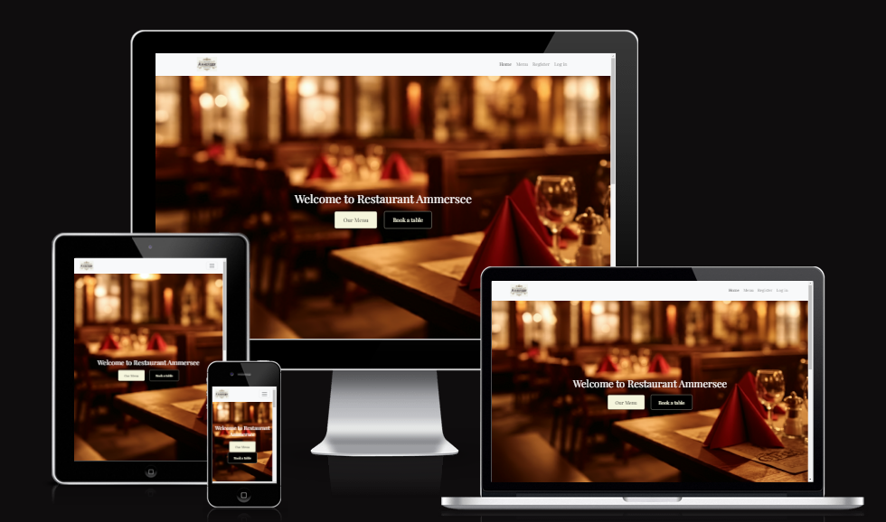
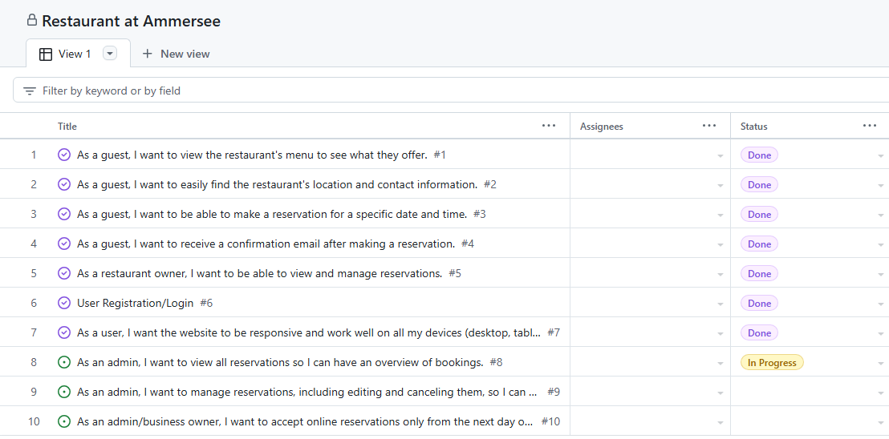
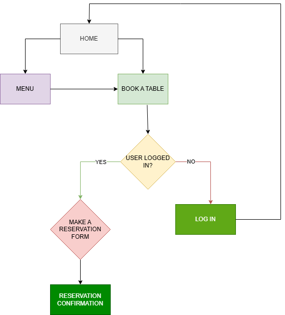
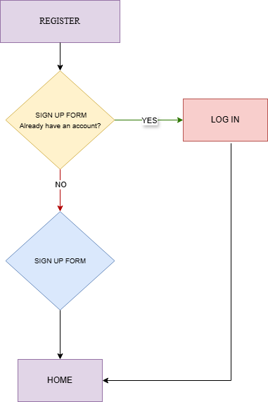
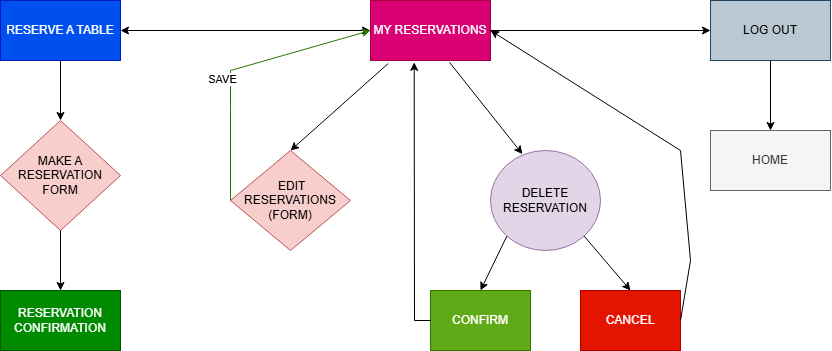
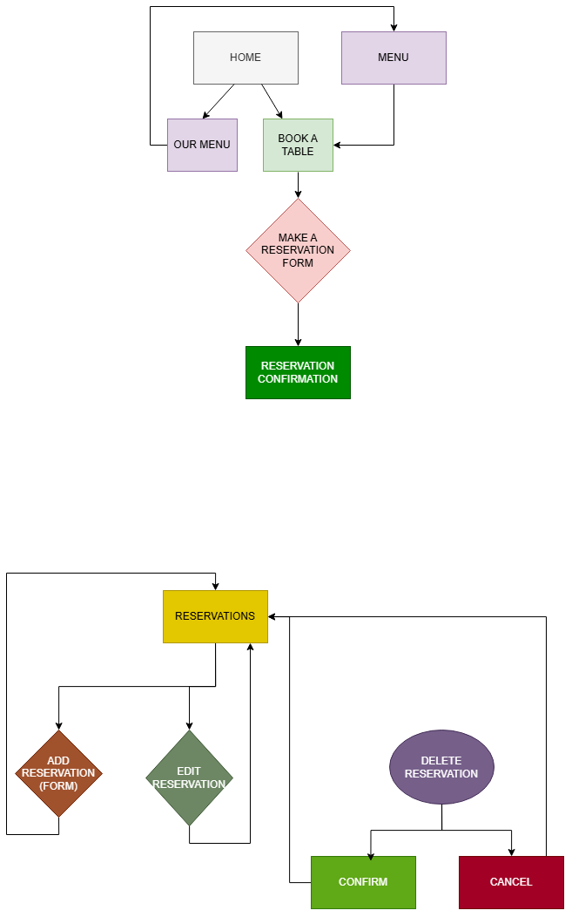

# RESTAURANT AM AMMERSEE

## Introduction

"Restaurant am Ammersee" is a full-stack, responsive website designed as a practical exercise in web development. This project simulates a real-world scenario where a restaurant located on Lake Ammersee needs an online presence to showcase its menu and manage table reservations.

This project served as a valuable learning experience in various web development technologies, including front-end design, back-end logic, and database management. It demonstrates the ability to create a functional and user-friendly web application that meets the needs of a modern restaurant business.

**Note:** This website is intended for educational purposes only and does not represent a real business or accept actual reservations.

[Link to the live website of Restaurant am Ammersee](https://restaurant-ammersee-436b83e7ebb7.herokuapp.com/)

## Table of Contents

* [Responsive Design](#responsive-design)
* [Agile Methodology](#agile-methodology)
* [Site Goals](#site-goals)
* [User Stories](#user-stories)
* [Features](#features)
    * [Header & Navigation](#header--navigation)
    * [Footer](#footer)
    * [Home Page](#home-page)
    * [Menu Page](#menu-page)
    * [Register Page](#register-page)
    * [Login Page](#login-page)
    * [Logout Page](#logout-page)
    * [Reserve a Table Page](#reserve-a-table-page)
    * [My Reservations Page](#my-reservations-page)
* [Admin Panel](#admin-panel)
    * [Overview](#overview)
    * [Accessing the Admin Panel](#accessing-the-admin-panel)
    * [Reservation Management](#reservation-management)
    * [User Interface](#user-interface)
    * [Security](#security)
* [Future Features and Improvements](#future-features-and-improvements)
* [Technologies Used](#technologies-used)
* [Testing](#testing)
* [Deployment](#deployment)


## Responsive Design

Ensures a seamless user experience across various devices (desktops, tablets, and mobile phones).



[Back to top](#restaurant-am-ammersee) <br>


## Agile Methodology

This project was developed following Agile principles, which emphasize iterative development, continuous feedback, and a flexible approach to accommodate changes. I used GitHub Issues to maintain a dynamic and transparent record of all User Stories and tasks. You can explore the project's evolution and all documented issues [here](https://github.com/Amila3951/restaurant_ammersee/issues).

Agile development allowed me to adapt to new insights and challenges throughout the project lifecycle. By breaking down the project into smaller, manageable tasks and prioritizing essential features, I ensured a consistent focus on delivering a functional and valuable product.

<details>
<summary>Kanban Board</summary>


</details>
<br>

To visually manage the project's workflow and track progress, I utilized a Kanban board. This provided a clear overview of tasks and their progress without imposing strict time constraints, allowing for flexibility and adaptability throughout the development process. While I opted for a flexible approach without fixed timeboxes for each iteration, the Kanban board helped me visualize the workflow and prioritize tasks effectively, ultimately contributing to better time management and a more focused development process.

[Back to top](#restaurant-am-ammersee) <br>


## Site Goals

To provide a seamless online experience for Restaurant am Ammersee, offering easy access to the menu, location information, and a user-friendly reservation system across all devices.

[Back to top](#restaurant-am-ammersee) <br>


## User Stories

### As an Admin

*   **Accept online reservations only from the next day onward:** As an admin/business owner, I want to accept online reservations only from the next day onward so that I can manage reservations efficiently.
*   **Manage reservations (edit and cancel):** As an admin, I want to manage reservations, including editing and canceling them, so I can handle changes and cancellations.
*   **View all reservations:** As an admin, I want to view all reservations so I can have an overview of bookings.

### As a User/Guest

*   **Responsive website:** As a user, I want the website to be responsive and work well on all my devices (desktop, tablet, mobile) so I can access it from anywhere.
*   **User registration/login:** As a user, I want to be able to register with my name, email address, and a secure password, and then log in to access my account.
*   **Receive a confirmation email after making a reservation:** As a guest, I want to receive a confirmation email after making a reservation.
*   **Make a reservation for a specific date and time:** As a guest, I want to be able to make a reservation for a specific date and time.
*   **Easily find the restaurant's location and contact information:** As a guest, I want to easily find the restaurant's location and contact information.
*   **View the restaurant's menu:** As a guest, I want to view the restaurant's menu to see what they offer.

[Back to top](#restaurant-am-ammersee) <br>


# Features

## Structure / Design

This website prioritizes user experience through a clean and intuitive design, ensuring easy navigation and a consistent look and feel across all pages.  It features a responsive layout that adapts seamlessly to various screen sizes, from smartphones (320px) to large desktop displays (2560px).

A persistent navigation menu, visible on every page, includes the restaurant logo and a user-friendly hamburger menu on mobile devices. This menu provides effortless access to essential sections, including Home, Menu, Registration, Login, and Logout functionalities.

Each page is complemented by a uniform footer, housing links to the restaurant's social media presence. These links open in new tabs to maintain an uninterrupted browsing experience for the user. The footer also presents essential information such as the restaurant's address, contact details, a map for easy location, phone number, and email address. These elements are also linked and open in new tabs for user convenience. This consistent footer design reinforces the website's visual identity and streamlines navigation.

The home page effectively introduces the restaurant, featuring prominent hero sections that display the restaurant's name and compelling call-to-action buttons directing users to explore the menu or make a reservation. Additionally, the home page offers insights into the restaurant's background and atmosphere.

A dedicated menu page provides a comprehensive overview of the culinary offerings, categorized into appetizers, main courses, beverages, and desserts. Convenient links for table reservations are also readily available on this page.

User registration and login are facilitated through easily accessible pages linked from the main navigation menu. These pages are designed with clarity and user-friendliness in mind, adhering to web standards for a smooth and intuitive account creation and login process.

For administrative purposes, a dedicated interface offers specialized views for managing reservations. This includes functionalities for adding new reservations, editing existing ones, and deleting reservations with confirmation steps to prevent unintended actions.

Overall, the website's structure and design are carefully crafted to prioritize user-friendliness, clarity, and a consistent experience across all pages and functions, catering to both general users and administrators.

## Diagrams

This project began with simple diagrams outlining the core website functionalities. These visuals provided a framework for development and a user-centric design. As the project evolved, adjustments were made to ensure the site met required standards and delivered a seamless user experience, including responsiveness, accessibility, security, and performance. This iterative process of refinement resulted in a polished and effective platform that is both user-friendly and efficient.

<details>
<summary>Diagrams</summary>

* **Home Page**



* **Register**



* **User (Logged in)**



* **Admin**



</details>


## Existing Features

### Header & Navigation

Featured on all pages, the fully responsive header of Restaurant am Ammersee ensures seamless navigation across all devices:

*   **Logo:** Positioned on the left, the logo acts as a clickable link, smoothly redirecting users to the homepage.
*   **Navigation Bar (Large Screens):** On larger screens, a user-friendly navigation bar provides clear links to key sections: Home, Menu, Register, Log in.
*   **Hamburger Menu (Small Screens):** For smaller screens, a compact hamburger menu declutters the interface. Upon activation, it expands to reveal a complete navigation list, mirroring the options available on larger screens.
*   **Dynamic Login/User Links:** The navigation bar intelligently adapts to the user's status:
    *   **Guests:** Presented with "Register" and "Login" options.
    *   **Logged-in Users:** Links change to "Reserve a table", "My Reservations", and "Logout" for quick access to account management.
*   **Admin Access:** A dedicated admin profile with the credentials "username: admin" and "password: admin123" allows the restaurant owner to access a specialized navigation bar upon login. This admin navigation includes: Home, Menu, Reservations, Logout.

This dynamic header ensures intuitive navigation and a personalized experience for both guests and the restaurant administrator.

[Back to top](#restaurant-am-ammersee) <br>


### Footer

The responsive footer of Restaurant am Ammersee provides valuable information and encourages user engagement across all devices. It features a clear three-column layout:

*   **Left Column (Social Media):** Connects users to the restaurant's social media presence with icons linking to platforms like Facebook, Instagram, and YouTube. These links open in new tabs.
*   **Center Column (Location Details):** Displays the restaurant's complete address, ensuring visitors can easily find the establishment.
*   **Right Column (Contact and Map):** Provides essential contact information and location visualization:
    *   **Contact Details:**
        *   Telephone: Clickable phone number that initiates a call on mobile devices or displays the number for dialing on desktops.
        *   Email: Clickable email address that opens the user's default email client, pre-populated with the restaurant's address.
    *   **Interactive Map:** An embedded map allows users to visually locate the restaurant, explore the surrounding area, and obtain directions.
*   **Copyright Notice:** A concise copyright statement is positioned at the bottom of the footer.
*   **Visual Cues:** All links throughout the footer are styled with a pointer cursor to provide clear visual feedback to users.

This structured footer ensures users can easily connect with Restaurant am Ammersee, find its location, and access relevant contact information through their preferred channels, enhancing communication and fostering a positive user experience.

[Back to top](#restaurant-am-ammersee) <br>


### Home Page

The home page serves as the landing page for the Restaurant Ammersee website. It provides a visually appealing introduction to the restaurant and its offerings.

*   **Features:**
    *   **Hero Section:** A large hero image with welcoming text and call-to-action buttons.
    *   **Welcome Message:** A concise welcome message greets visitors and sets a friendly tone.
    *   **Call-to-Action Buttons:** Two primary call-to-action buttons, "Our Menu" and "Book a table," facilitate easy navigation to key sections of the website. These buttons are enhanced with a hover effect to provide visual feedback to the user.
    *   **Our Story:** This section provides a narrative overview of the restaurant's history, values, and commitment to culinary excellence. It aims to establish a connection with visitors by conveying the restaurant's unique identity and passion for hospitality.
*   **Functionality:**
    *   **Menu Navigation:** The "Our Menu" button directs visitors to the menu page, where they can explore the restaurant's culinary offerings in detail.
    *   **Conditional Booking:** The "Book a table" button dynamically adjusts its behavior based on the user's authentication status.
        *   **Authenticated Users:** If the user is logged in, the button directs them to the reservation form to book a table.
        *   **Guests:** If the user is not logged in, the button redirects them to the login page, prompting them to authenticate before proceeding with a reservation.

The home page is designed to give visitors a quick and engaging overview of Restaurant Ammersee. It's the perfect starting point for exploring the website and discovering all that the restaurant has to offer.

[Back to top](#restaurant-am-ammersee) <br>


### Menu Page

The menu page displays the restaurant's culinary offerings in a structured and visually appealing manner. It is organized into categories (Appetizers, Main Courses, Desserts, Drinks) for easy browsing. Each menu item includes the dish name, a brief description, and the price. The page also features a prominent "Book a Table" button, providing a convenient way for users to make a reservation after browsing the menu.

[Back to top](#restaurant-am-ammersee) <br>


### Register Page

The register page is a crucial component of the Restaurant Ammersee website, as it enables new users to create accounts and gain access to personalized features such as online reservations and managing their booking history.

*   **Purpose:** The primary purpose of the register page is to facilitate the registration of new users by providing a user-friendly interface for creating an account. This process involves collecting essential information from the user, validating the input, and securely storing the data for future authentication.
*   **Features:**
    *   **Registration Form:** The page features a concise registration form that prompts users to provide their email address and a password. The form employs Django's built-in form handling mechanisms, ensuring efficient data processing and validation.
    *   **Email Field:** The email field is designed to capture the user's email address.
    *   **Password Field:** The password field allows users to set a secure password for their account. The field enforces password complexity rules to enhance security.
    *   **Submit Button:** The "Sign Up" button triggers the form submission, initiating the registration process.
    *   **Login Link:** A link to the login page is provided for users who already have an account, allowing them to access their existing profiles.
*   **Functionality:**
    *   **Form Handling:** The form utilizes Django's `UserCreationForm` to handle user registration, leveraging the framework's built-in capabilities for user management.
    *   **EmailJS Integration:** The page integrates with EmailJS, a third-party email service, to send a welcome email to newly registered users. This integration enhances the user experience by providing immediate confirmation of successful registration.
    *   **Client-Side Validation:** JavaScript code is employed to perform client-side validation of the form input, ensuring that the email address is in a valid format and that the password meets the required complexity criteria.
    *   **Automatic Login:** Upon successful registration, the user is automatically logged in to their new account, providing a seamless transition to the website's features.
*   **User Experience:** The register page prioritizes a user-friendly experience by providing a clear and concise registration form, immediate feedback on form submission, and a seamless transition to the user's new account. The integration of EmailJS adds a professional touch by sending a personalized welcome email, further enhancing user satisfaction.

[Back to top](#restaurant-am-ammersee) <br>


### Login Page

The login page provides a secure gateway for registered users to access their accounts on the Restaurant Ammersee website. It presents a straightforward login form that prompts users to enter their credentials for authentication.

*   **Purpose:** The primary purpose of the login page is to authenticate users who have previously registered on the website. This process involves verifying the user's identity by comparing their entered credentials with the stored data in the system. Successful authentication grants users access to personalized features and functionalities.
*   **Features:**
    *   **Login Form:** The page features a concise login form that requires users to provide their username and password. The form utilizes Django's built-in form handling mechanisms for efficient data processing and validation.
    *   **Username Field:** The username field prompts users to enter their unique username, which serves as their identifier in the system.
    *   **Password Field:** The password field requires users to enter their secret password associated with their account. The field is designed to mask the entered characters for security purposes.
    *   **Submit Button:** The "Login" button triggers the form submission, initiating the authentication process.
    *   **Registration Link:** A link to the registration page is provided for users who do not have an account, allowing them to create a new profile.
    *   **Error Message:** An error message is displayed if the user enters invalid credentials, providing immediate feedback and guiding them to correct their input.
*   **Functionality:**
    *   **Form Handling:** The form utilizes Django's authentication framework to handle user login, leveraging the framework's built-in capabilities for user management and security.
    *   **Authentication:** The entered username and password are compared against the stored credentials in the database. If the credentials match, the user is authenticated and granted access to their account.
    *   **Error Handling:** If the entered credentials are invalid, an error message is displayed to inform the user and prevent unauthorized access.
    *   **Session Management:** Upon successful login, a session is created to maintain the user's authenticated state throughout their interaction with the website.
*   **User Experience:** The login page prioritizes a user-friendly experience by providing a clear and concise login form, immediate feedback on authentication attempts, and a convenient link to the registration page for new users. The error message provides clear guidance in case of invalid credentials, ensuring a smooth and efficient login process.

[Back to top](#restaurant-am-ammersee) <br>


### Logout Page

The Restaurant Ammersee website provides a secure logout process for authenticated users. This functionality is accessible through a dedicated "Logout" option in the navigation bar, visible only to users who are currently logged in.

*   **Log Out:** Clicking the "Log Out" button within the confirmation dialog initiates the logout process. This action clears the user's session data, effectively logging them out of their account. Upon successful logout, users are redirected back to the home page.

[Back to top](#restaurant-am-ammersee) <br>

## Reserve a Table Page

**On this page:**

* **Purpose:** This page serves as the primary interface for guests to submit reservation requests. It collects essential information from the guest, such as contact details, preferred date and time, and the number of people in their party. This information is then used to manage reservations and ensure a smooth dining experience for all guests.
* **Access:** To ensure personalized service and manage reservations effectively, the "Reserve a Table" page is accessible only to logged-in users. Guests who are not logged in will be redirected to the login page before they can make a reservation.
* **Features:**
    * **Reservation Form:** A clear and concise form is presented to the user, prompting them to provide the necessary information for their reservation.
        * **Contact Information:** Fields for name, email address, and phone number allow the restaurant to contact the guest for confirmation or any necessary communication.
        * **Reservation Details:** Fields for date, time, and number of people in the party capture the essential details of the reservation request.
        * **Error Handling:** The form includes mechanisms to handle potential errors, such as invalid input or unavailable time slots, providing immediate feedback to the user.
    * **Date Picker:** A user-friendly date picker is integrated into the form, making it easy for guests to select their preferred reservation date. The date picker enforces a minimum date to prevent reservations for past dates, ensuring that reservations can only be made for future dates. This is implemented using JavaScript to dynamically set the minimum selectable date to tomorrow.
    * **Time Picker:** A time picker allows guests to choose their preferred dining time, providing a clear and intuitive selection process. The time picker also incorporates validation to ensure that the selected time falls within the restaurant's opening hours (10:00 - 22:00). If a time outside these hours is chosen, an error message is displayed to the user.
    * **Submit Button:** A prominent "Reserve" button submits the reservation request to the system.
* **Functionality:**
    * **Data Collection:** The form efficiently collects all necessary information for processing the reservation request.
    * **Validation:** The form incorporates validation rules to ensure that the entered data is in the correct format and meets the required criteria. This includes custom validation for the date field to ensure it's not in the past and for the time field to ensure it falls within the restaurant's opening hours.
    * **Error Handling:** If any errors are detected during validation, informative error messages are displayed to guide the user in correcting their input.
    * **Reservation Processing:** Upon successful submission, the reservation request is processed by the system, checking for availability and confirming the reservation.
    * **Confirmation Email:** A confirmation email is sent to the user's registered email address, containing the details of their reservation and any relevant information they may need.
* **User Experience:** The "Reserve a Table" page prioritizes a seamless and user-friendly reservation process. The form is designed to be intuitive and easy to complete, with clear instructions and helpful error messages. The integration of date and time pickers further enhances the user experience by providing convenient selection tools. The confirmation email provides reassurance and all necessary details for the reservation.


## My Reservations Page

**On this page:**

* **Purpose:** This page serves as a personal reservation management tool for registered users. It enables users to easily access and modify their upcoming reservations, providing flexibility and control over their dining arrangements.
* **Features:**
    * **Reservation List:** A comprehensive list of the user's upcoming reservations is displayed in a clear and organized format.
    * **Reservation Details:** Each reservation entry includes essential details such as the name on the reservation, date, time, and the number of guests.
    * **Action Buttons:** Each reservation entry includes "Edit" and "Delete" buttons, allowing users to modify or cancel their reservations with ease.
    * **Responsive Design:** The reservation list is presented in a responsive table format, ensuring optimal viewing on various devices, including desktops, tablets, and mobile phones.
    * **User-Friendly Interface:** The page is designed with a user-friendly interface, making it easy for users to navigate and manage their reservations.
* **Functionality:**
    * **Reservation Retrieval:** The page dynamically retrieves and displays the logged-in user's upcoming reservations from the database.
    * **Edit Reservation:** The "Edit" button allows users to modify the details of an existing reservation, such as the date, time, or number of guests.
    * **Delete Reservation:** The "Delete" button enables users to cancel a reservation, freeing up the reserved time slot for other guests.
    * **Confirmation:** Before deleting a reservation, a confirmation dialog is presented to prevent accidental cancellations.
* **User Experience:** The "My Reservations" page prioritizes user convenience and control over their dining plans. The clear and organized reservation list, combined with the intuitive action buttons, provides a seamless experience for managing reservations. The responsive design ensures that users can access and manage their reservations from any device. Overall, the page empowers users to easily maintain and adjust their dining arrangements at Restaurant Ammersee.


# Admin Panel

## Overview

**On this page:**

The Admin Panel for "Restaurant am Ammersee" provides administrative users with privileged access to manage reservations and view key data. This panel is designed to streamline operations and provide a centralized hub for managing the restaurant's online reservation system.

## Accessing the Admin Panel

The Admin Panel is accessible only to users with administrative privileges. The default admin account has the following credentials:

* **Username:** admin
* **Password:** admin123

Upon logging in with these credentials, the admin user is presented with a specialized navigation bar that provides access to the following sections:

* **Home:** Redirects to the restaurant's home page.
* **Menu:** Displays the restaurant's menu.
* **Reservations:** Provides access to the reservation management section.
* **Logout:** Logs the admin user out of the system.

## Reservation Management

The Reservations section within the Admin Panel is a core feature, offering a comprehensive overview and control over all reservations. It provides the following functionalities:

* **View All Reservations:** Displays a table listing all existing reservations with details such as guest name, contact information, reservation date and time, and number of guests.
* **Add Reservation:** Allows the admin to manually add new reservations to the system. This is useful for handling phone reservations.
* **Edit Reservation:** Enables the admin to modify the details of existing reservations, such as changing the date, time, or number of guests.
* **Delete Reservation:** Allows the admin to cancel existing reservations. A confirmation dialog is presented before deletion to prevent accidental cancellations.

## User Interface

The Admin Panel is designed with a user-friendly interface that is consistent with the overall design of the Restaurant am Ammersee website. Key features of the interface include:

* **Clear Navigation:** The specialized navigation bar provides quick and easy access to all admin functionalities.
* **Organized Tables:** Reservation data is presented in organized tables with clear headings and concise information.
* **Action Buttons:** Intuitive action buttons ("Edit" and "Delete") are provided for each reservation entry to facilitate quick actions.
* **Confirmation Dialogs:** Confirmation dialogs are used for critical actions like deleting reservations to prevent unintended consequences.

## Security

The Admin Panel is secured by requiring users to log in with valid administrative credentials. This ensures that only authorized personnel can access and modify sensitive reservation data.


## Future Features and Improvements

This section outlines potential features and improvements that could be implemented in future versions of the Restaurant Ammersee website to enhance its functionality and user experience.

**1. Account Management**

* **Forgot/Reset Password:** Implement functionality for users to reset their passwords in case they forget them. This will improve account security and user experience.
* **"Remember Me" Option:** Provide a "Remember Me" checkbox on the login form to allow users to stay logged in for a longer period.
* **Show Password:** Add a "show password" toggle to the login and registration forms to allow users to see their password as they type. This improves usability and reduces errors.

**2. Enhanced Reservation System**

* **Interactive Table Reservation:**
    * Display an interactive floor plan of the restaurant showing available tables.
    * Allow users to visually select their preferred table during the reservation process.
    * Clearly indicate occupied and available tables in real-time.

**3. User Engagement and Feedback**

* **Reviews and Ratings:**
    * Enable users to leave reviews and ratings for the restaurant and its dishes.
    * Display average ratings and the number of reviews to provide social proof.
    * Allow users to filter reviews by rating or date.

**4. Visual Appeal and Content**

* **Image Gallery:**
    * Showcase high-quality images of the restaurant's dishes, interior, and exterior to enhance visual appeal.

**5. Website Design and User Experience**

* **Enhanced Styling:** While the current design prioritizes simplicity and user-friendliness with minimal background images and straightforward forms, future iterations could explore more visually engaging elements and richer content. This could include:
    * More sophisticated use of typography and color palettes.
    * Integration of high-quality photography and videography.

**6. Booking History Validation**

* **Automatic Removal of Old Bookings:** Implement a mechanism to automatically remove outdated bookings from the user's booking history. This will ensure the history remains relevant and clutter-free by removing entries that are no longer valid against the current and future dates.

**7. Admin Panel Improvements**

* **Reservation Filtering and Sorting:** Enhance the admin panel with the ability to filter and sort reservations by various criteria, including:
    * Name
    * Date
    * Time
    * Number of guests
* **Email Confirmation for Admin-Created Reservations:** Currently, when an admin creates a reservation on behalf of a user, the user does not receive an email confirmation. In the future, this functionality should be implemented to ensure that all users receive confirmation emails for their reservations, regardless of how the reservation was created.


## Technologies Used

This project uses the following technologies:

### Languages

* **Python:** For backend logic.
* **HTML:** For website structure.
* **CSS:** For website styling.
* **JavaScript:** For interactivity.

### Libraries & Frameworks

* **Django (4.2.16):** Python web framework.
* **Django Allauth (65.3.0):** User authentication.
* **Bootstrap:** For styling and responsiveness.
* **EmailJS:** For sending emails.
* **asgiref (3.8.1):** For asynchronous operations.
* **django-debug-toolbar (4.4.6):** For debugging.
* **django-extensions (3.2.3):** Extra Django tools.
* **gunicorn (20.1.0):** Production web server.
* **oauthlib, PyJWT, python3-openid, requests-oauthlib:** For authentication.
* **sqlparse (0.5.1):** SQL query tool.
* **whitenoise (6.5.0):** For serving static files.
* **Font Awesome:** For icons. 

### Tools

* **Git:** Version control.
* **GitHub:** Code repository.
* **Gitpod:** Development environment.
* **W3C Validator:**  A validator which checks the markup validity of Web documents in HTML, XHTML, SMIL, MathML, etc.
* **W3C CSS Validation Service:** A validator which checks the validity of CSS code.
* **Code Institute's Python Linter:** Highlights syntactical and stylistic problems in Python source code.
* **Chrome DevTools:** Web Developer Tools.
* **Google Fonts:** Fonts
* **JSHint:** A JavaScript code analysis tool used to detect errors and potential problems


# Testing

For detailed information on testing procedures, please refer to the [TESTING.md](TESTING.md) file.


# Deployment

This project is deployed to Heroku.

**Prerequisites:**

* **Heroku Account:** A free Heroku account is required to deploy and manage your application. Sign up at [heroku.com](https://www.heroku.com).
* **PostgreSQL Database:** A PostgreSQL database is necessary for data persistence. You can provision a database through Heroku Postgres or utilize an external provider.
* **Git:** Git is used for version control and to push your code to Heroku. Ensure Git is installed on your local machine.

**Deployment Steps:**

1. **Create a Heroku Application:**
   * Log in to your Heroku account and navigate to the dashboard.
   * Click the "New" button and select "Create new app."
   * Provide a unique name for your application and choose the appropriate region.
   * Click "Create app" to initialize your Heroku application.

2. **Create the PostgreSQL Database**
   * Login to https://dbs.ci-dbs.net/.
   * step 1: enter your email address and submit.  
   * step 2: creates a database.  
   * step 3: receive the database link on your email id. 

3. **Configure Environment Variables:**
   * **Environment File:** Create a file named `env.py` in your project's root directory.
   * **Database URL:** In `env.py`, define the `DATABASE_URL` variable with the connection URL obtained in the previous step.
   * **Secret Key:** Generate a secure secret key and assign it to the `SECRET_KEY` variable in `env.py`.
   * **Gitignore:** Add `env.py` to your `.gitignore` file to prevent sensitive information from being committed to version control.
   * **Settings Configuration:** Modify your project's `settings.py` file to:
      * Import `dj_database_url` and load environment variables from `env.py`.
      * Configure the database connection using `dj_database_url.parse()`.
      * Add your Heroku app's URL to the `ALLOWED_HOSTS` setting.

4. **Create a Procfile:**
   * In your project's root directory, create a file named `Procfile` (without any file extension).
   * This file specifies the commands executed by Heroku to run your application.
   * Add the following line to your `Procfile`, replacing `your_project_name` with your project's actual name:
      ```
      web: gunicorn your_project_name.wsgi
      ```

5. **Prepare for Deployment:**
   * **Dependency Management:** Install `gunicorn` (WSGI server) and `psycopg2-binary` (PostgreSQL adapter) using `pip install gunicorn psycopg2-binary`.
   * **Requirements File:** Update your `requirements.txt` file to include the newly installed packages.
   * **Commit and Push:** Commit all your changes and push them to your Git repository.

6. **Deploy to Heroku:**
   * In your Heroku app's dashboard, navigate to the "Deploy" tab.
   * Select "GitHub" as the deployment method and connect your GitHub repository.
   * Choose the branch you want to deploy and click "Deploy Branch."
   * Heroku will build your application and deploy it to its servers. Once the process is complete, you will see a success message.

7. **Final Deployment:**
   * **Disable Debug Mode:** In your project's `settings.py` file, set `DEBUG = False` to disable debug mode for production.
   * **Enable Static Files Collection:** In your Heroku app's settings, remove the `DISABLE_COLLECTSTATIC` config var to allow Heroku to collect static files.
   * **Redeploy:** Redeploy your application to apply these changes.

**Note:** These instructions provide a comprehensive guide to deploying your Django application to Heroku. However, depending on your specific project configuration and requirements, you may need to make further adjustments. Refer to the official Heroku documentation for more detailed information and troubleshooting tips.

## Credits and Acknowledgements

This project wouldn't have been possible without the support and inspiration from various resources. I extend my sincere thanks to the following:

**Educational Foundations:**

* **Code Institute:** The Diploma in Software Development program, along with its comprehensive curriculum and hands-on projects like the "I Think Therefore I Am Blog," laid the groundwork for my understanding of web development principles. 
I would also like to express my sincere gratitude for the outstanding support provided by Code Institute's tutors. Their prompt, efficient, and insightful guidance was invaluable throughout the development process. Their expertise and willingness to help were essential to overcoming challenges and achieving the project's goals.
* **Code Institute's LMS:** The Learning Management System proved to be an invaluable resource, offering ongoing support and guidance throughout the project's lifecycle.
* **Official Documentation:**  I relied heavily on the official documentation for Django, Bootstrap, and Django Allauth to gain a deep understanding of their functionalities and best practices.

**Development Tools & Technologies:**

* **Version Control & Collaboration:** Git and GitHub were essential for managing code revisions and facilitating a collaborative development workflow.
* **Code Quality & Validation:** Tools like JSHint,  W3C Validator played a crucial role in ensuring code quality, cross-browser compatibility, and adherence to web standards.
* **Debugging & Optimization:** Chrome DevTools proved invaluable for debugging front-end code and optimizing website performance.
* **Design Resources:** Google Fonts provided a diverse selection of typefaces to enhance the visual appeal of the website.

**General Assistance:**

* **Google Search:**  A constant companion throughout the project, providing answers, solutions, and inspiration whenever needed.


[Back To Top](#table-of-contents)
____