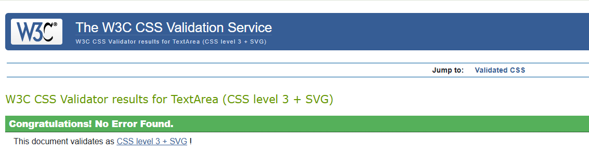

# Testing

This document outlines the testing strategy employed to ensure the quality and functionality of the Restaurant Ammersee website. A combination of manual and automated testing was utilized to provide comprehensive coverage. Manual testing was conducted to thoroughly assess core functionality, user experience, and usability. Automated testing, specifically unit and integration tests, was implemented to increase efficiency and repeatability in verifying individual code units and their interactions. Furthermore, code validation was performed using various validators to ensure adherence to web standards and best practices.

While the current testing strategy provides a solid foundation, future iterations will focus on expanding automated testing coverage to further enhance the robustness and reliability of the application.

## Table of Contents

* [Code Validation](#code-validation)
    * [HTML](#html)
    * [CSS](#css)
    * [Python](#python)
    * [JavaScript](#javascript)
* [Automated Tests](#automated-tests)
* [Manual Testing](#manual-testing)

## Code Validation

### HTML

**W3C Markup Validation Service:** All HTML code was validated using the official W3C Markup Validation Service to ensure adherence to web standards and identify any potential issues.

Screenshots and results for all templates.

 

* **Home**

* **Menu**

* **Register**

   * Some HTML validation errors are ignored due to the limitations of Django's template engine in generating perfectly valid HTML for forms. These errors do not affect the functionality or user experience of the website.

* **Log In**

* **Make a Reservation**

* **My Reservations**

* **Edit Reservation**

* **Delete Reservation**

* **Admin Reservation**

* **Admin Add Reservation**

* **Admin Edit Reservation**

* **Admin Delete Reservation**

[Back to top](#testing)  

### CSS

CSS code was tested using the **W3C CSS Validation Service** via text input.

Screenshots and results for all templates.

 

* **Style.css**

* **Reservations.css**

[Back to top](#testing)  

### Python

Python code was tested using [Code Institute's Python Linter](https://pep8ci.herokuapp.com/).

Screenshots and results for all python files

* settings.py

* ammersee/urls.py

* wsgi.py

* forms.py

* models.py

* tests.py

* urls.py

* views.py

[Back to top](#testing)  

### JavaScript

JavaScript code was tested using [JSHint](https://jshint.com/).

Screenshots and results for all JS files

 

* email.js

**JSHint Warning: "One undefined variable emailjs"**

This warning occurs because JSHint analyzes JavaScript code independently and doesn't recognize the emailjs variable loaded from HTML.

* reservation.js

[Back to top](#testing)  

## Automated Tests

Automated tests were implemented using the Django testing framework. These tests focus on verifying the behavior of specific units of code and their integration within the application.

Test Suites

 

###  `MakeReservationViewTest`

This test suite focuses on the `make_reservation` view, which handles the creation of new reservations.

* **`test_make_reservation_valid_form`:** This test case verifies that a valid reservation form successfully creates a new reservation in the database and redirects the user to the confirmation page.
* **`test_make_reservation_invalid_form`:** This test case ensures that an invalid reservation form (e.g., with a past date) does not create a new reservation and returns an appropriate error response.

### `MyReservationsViewTest`

This test suite focuses on the `my_reservations` view, which displays a user's existing reservations.

* **`test_my_reservations_logged_in`:** This test case checks that the view correctly displays the user's reservations when they are logged in.
* **`test_my_reservations_not_logged_in`:** This test case verifies that the view redirects to the login page when the user is not logged in.

[Back to top](#testing)  

## Manual Testing

**Objective:** To verify the functionality and user experience of the Restaurant Ammersee website and ensure it aligns with the specified requirements.

**Methodology:** A series of test cases were executed manually, covering key user interactions and functionalities across different sections of the website. Each test case involved specific actions and observations to determine if the actual outcome matched the expected behavior.

Test Cases and Results

 

**NAVBAR**

**BUTTONS (HOME PAGE)**

**SOCIAL MEDIA ICONS (FOOTER)**

**CONTACT LINKS (FOOTER)**

**BUTTONS (MENU PAGE)**

**RESERVE A TABLE**

**MY RESERVATIONS**

**REGISTER / SIGN UP**

**LOG OUT**

**ADMINISTRATION PANEL**

**EMAILJS**

[Back to top](#testing)  

[Back to README](README.md)